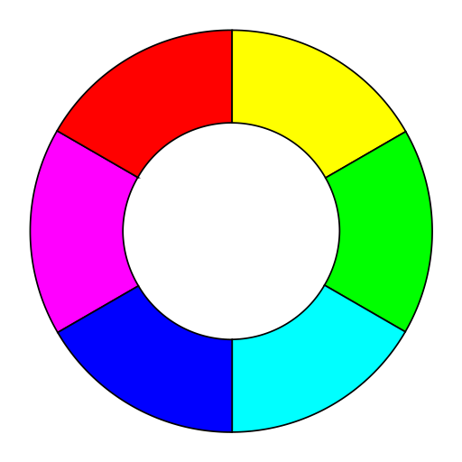

<div id="top"></div>

<h1 align="center">vkBasalt ReShade Shader Collection</h1>

<br />
<div align="center">

[![Vulkan][vulkan-shield]][vulkan-url]
[![Linux][linux-shield]][linux-url]
[![Git][git-shield]][git-url]

![Release Pipeline][test-pipline-badge]

</div>


<!-- PROJECT LOGO -->
<br />
<div align="center">
  <a href="https://github.com/DadSchoorse/vkBasalt">
    
    <br >
    
  </a>

  <h3 align="center">vkBasalt ReShade Shader Collection</h3>

  <p align="center">
    This repository contains a curated collection of ReShade shaders, LUTs, and textures for use with vkBasalt on Linux, enabling advanced post-processing effects for Vulkan-based games.
    <br />
    <a href="https://github.com/DadSchoorse/vkBasalt"><strong>Explore the documentation »</strong></a>
    <br />
    <br />
    <a href="https://github.com/DadSchoorse/vkBasalt">View Demo</a>
    ·
    <a href="https://github.com/DadSchoorse/vkBasalt/issues">Report Bug</a>
    ·
    <a href="https://github.com/DadSchoorse/vkBasalt/issues">Request Feature</a>
  </p>
</div>

<!-- TABLE OF CONTENTS -->
## Table of Contents

- [About The Project](#about-the-project)
  - [Built With](#built-with)
- [Disclaimer](#disclaimer)
- [Getting Started](#getting-started)
  - [Deployment Steps](#deployment-steps)
- [Usage](#usage)
  - [Example vkBasalt Config](#example-vkbasalt-config)
- [Roadmap](#roadmap)
- [Contributing](#contributing)
- [License](#license)
- [Contact](#contact)
- [Acknowledgments](#acknowledgments)
- [References](#references)

<!-- ABOUT THE PROJECT -->
## About The Project

The **vkBasalt ReShade Shader Collection** provides a complete set of shaders, textures, and LUTs for use with the [vkBasalt](https://github.com/DadSchoorse/vkBasalt) Vulkan post-processing layer on Linux.  

This collection enables:
- Advanced color grading with cinematic LUTs.
- Sharpening and clarity enhancements.
- Anti-aliasing improvements.
- Bloom, HDR simulation, and tone mapping.
- Specialized effects such as MXAO, SSR, and Depth of Field.

All resources are placed in `$HOME/.local/share/reshade` for system-wide access and can be loaded by vkBasalt via its configuration file. This is to ensure that:
- Avoid modifying /usr/share system-wide files.
- Keep shader configs isolated per user.
- Improve security and compatibility with systems that restrict global writes.


<p align="right">(<a href="#top">back to top</a>)</p>

### Built With

* [vkBasalt](https://github.com/DadSchoorse/vkBasalt)
* [ReShade](https://reshade.me/)
* [Linux](https://www.linux.org/)
* [SweetFX](https://github.com/CeeJayDK/SweetFX)
* [qUINT](https://github.com/martymcmodding/qUINT)
* [Prod80 Shaders](https://github.com/prod80/prod80-ReShade-Repository)

<p align="right">(<a href="#top">back to top</a>)</p>

<!-- DISCLAIMER -->
## Disclaimer

This shader collection is provided "as is" without any warranties or guarantees. The authors and contributors disclaim any liability for damages arising from its use.  

Compatibility has been tested with vkBasalt on modern Vulkan-capable Linux systems (AMD and NVIDIA GPUs), but functionality on other platforms or hardware configurations cannot be guaranteed.

Some shaders may require performance trade-offs depending on your GPU and resolution.

<p align="right">(<a href="#top">back to top</a>)</p>

<!-- GETTING STARTED -->
## Getting Started

To start using the **vkBasalt ReShade Shader Collection**, ensure that vkBasalt is installed and correctly configured for your system. These shaders are stored in `$HOME/.local/share/reshade` and can be referenced directly in your `vkBasalt.conf`.

### Deployment Steps

The deployment steps are fairly straight forward, ensure that vkbasalt is installed for your distro and copy the shaders with config to your local user directory.

   ```bash
   sudo apt install vkbasalt gamemode gamemode-daemon mangoapp mangohud mangohudctl goverlay
   git clone https://github.com/renvertere/vk-reshade
   cd vk-reshade
   cp -Rvf src/vk-reshade $HOME/.local/share/reshade
   mkdir $HOME/.config/vkBasalt/ 
   cp -Rvf resources/config/vkBasalt.conf $HOME/.config/vkBasalt/vkBasalt.conf
   sed -i "s|\$HOME|$HOME|g" $HOME/.config/vkBasalt/vkBasalt.conf

   ```
**Lastly! Enable vkBasalt When Running Games (Steam Game Launch Options)** 
   ```bash
   ENABLE_VKBASALT=1 %command%
   ```

**Alternatively, if you would like to make use of GameMode and MangoHUD please use:**
   ```bash
   ENABLE_VKBASALT=1 gamemoderun mangohud %command%
   ```

## Usage

Once installed, the **vkBasalt ReShade Shader Collection** can be customized by editing your `vkBasalt.conf`.  
You can enable or disable effects, adjust sharpening and vibrance, and apply LUT-based color grading depending on the game and your preferences.

For dark or dull scenes, this collection includes:
- **Moderate sharpening** for better texture clarity.
- **Balanced vibrance** without oversaturation.
- **Cinematic LUT** for richer tones.
- **Tone mapping** to increase depth and contrast.

<p align="right">(<a href="#top">back to top</a>)</p>

### Example vkBasalt Config
    # Enable core effects
    effects = Clarity:AdaptiveSharpen:CAS:SMAA:RS_Vibrance:LUT:ToneMap

    # Paths
    reshadeTexturePath = $HOME/.local/share/reshade/Textures
    reshadeIncludePath = $HOME/.local/share/reshade/Shaders

    # [Clarity]
    ClarityRadius=1
    ClarityStrength=0.3333331
    ClarityDarkIntensity=0.59
    ClarityLightIntensity=0.41

This configuration is optimized for **1440p** gameplay and designed to add visual depth without introducing strong halos or oversaturation.

<p align="right">(<a href="#top">back to top</a>)</p>

## Roadmap

- [x] Include complete ReShade shader repository in `$HOME/.local/share/reshade`.
- [x] Provide tuned vkBasalt configuration for dark/dull game scenes.
- [x] Bundle cinematic LUTs (Prod80 set) for high-quality grading.
- [ ] Integrate GravityMark Vulkan benchmark for performance testing.
- [ ] Add performance-optimized profiles for low-end GPUs.
- [ ] Provide per-game recommended configurations.
- [ ] Extend documentation with before/after visual comparisons.

See the open issues in the vkBasalt repository for additional planned features or known compatibility notes.

<p align="right">(<a href="#top">back to top</a>)</p>

---

## Contributing
[![Contributors][contributors-shield]][contributors-url]

Contributions to improve shader tuning, add optimized presets, or extend documentation are welcome.  
Please ensure changes are tested before submission, and reference the shader source author when adding new effects.

1. **Fork the repository**
2. **Create a feature branch**
3. **Commit your changes**
4. **Submit a pull request**

<p align="right">(<a href="#top">back to top</a>)</p>

## License
Distributed under the MIT License. See LICENSE.md for more information.

<p align="right">(<a href="#top">back to top</a>)</p>

---

## Contact
Ren - @renvertere

Project Link: [vkBasalt GitHub](https://github.com/DadSchoorse/vkBasalt)

<p align="right">(<a href="#top">back to top</a>)</p>

---

## Acknowledgments
- [vkBasalt](https://github.com/DadSchoorse/vkBasalt)
- [ReShade](https://reshade.me/)
- [SweetFX](https://github.com/CeeJayDK/SweetFX)
- [qUINT](https://github.com/martymcmodding/qUINT)
- [Prod80 Shaders](https://github.com/prod80/prod80-ReShade-Repository)
- [GravityMark](https://gravitymark.tellusim.com/)

<p align="right">(<a href="#top">back to top</a>)</p>

---

## References
- [ReShade Documentation](https://reshade.me/docs)
- [vkBasalt Wiki](https://github.com/DadSchoorse/vkBasalt/wiki)
- [SweetFX Shader Guide](https://github.com/CeeJayDK/SweetFX)
- [Prod80 Shader Documentation](https://github.com/prod80/prod80-ReShade-Repository)

<p align="right">(<a href="#top">back to top</a>)</p>

---

<!-- MARKDOWN LINKS & IMAGES -->
[vulkan-shield]: https://img.shields.io/badge/Vulkan-%23AC162C.svg?style=for-the-badge&logo=vulkan&logoColor=white
[vulkan-url]: https://www.vulkan.org/
[linux-shield]: https://img.shields.io/badge/Linux-FCC624?style=for-the-badge&logo=linux&logoColor=black
[linux-url]: https://www.linux.org/
[git-shield]: https://img.shields.io/badge/git-%23F05033.svg?style=for-the-badge&logo=git&logoColor=white
[git-url]: https://git-scm.com/
[test-pipline-badge]: https://img.shields.io/github/actions/workflow/status/DadSchoorse/vkBasalt/release-ci.yml?style=for-the-badge
[contributors-shield]: https://img.shields.io/github/contributors/DadSchoorse/vkBasalt.svg?style=for-the-badge
[contributors-url]: https://github.com/DadSchoorse/vkBasalt/graphs/contributors
